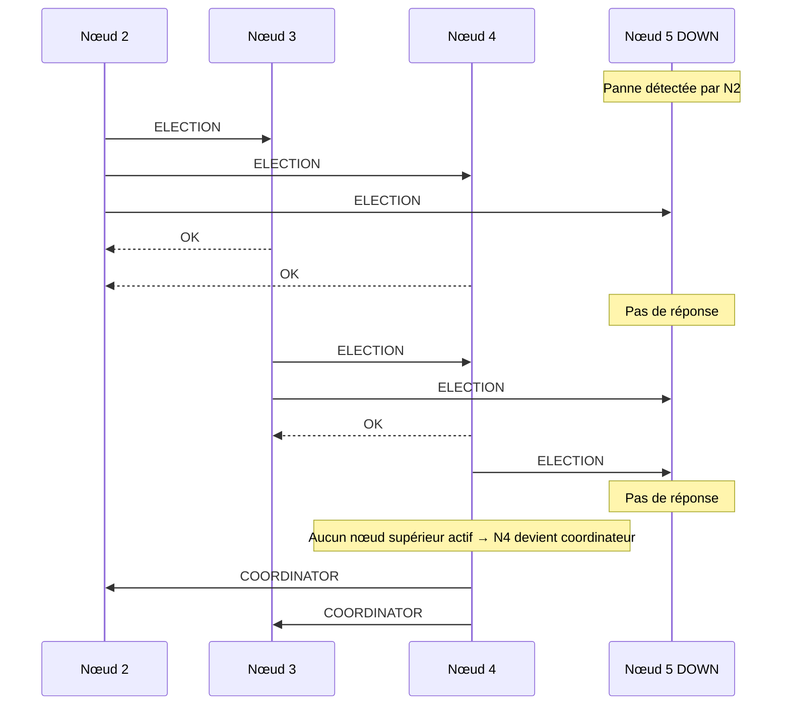

# Algorithme de Bully - Gwilherm Notes

## Introduction - Bully

L'algorithme de Bully est un algorithme d'**élection de leader** dans les systèmes distribués. L'objectif est simple : quand un nœud coordinateur tombe en panne, les nœuds restants doivent s'organiser pour en élire un nouveau.

Pourquoi le nom "Bully" ? C'est le nœud avec l'identifiant le plus élevé qui gagnera toujours et donc sera coordinateur.

---

## Contexte

Dans un système distribué, un leader est nécessaire pour :
- Centraliser les décisions
- Gérer l'accès à une ressource partagée
- Synchroniser les processus

Quand ce coordinateur disparaît (crash, réseau coupé...), il faut en élire un nouveau. C'est là qu'intervient l'algorithme de Bully dans un système distribué respectant ces points suivants :
- Chaque nœud a un identifiant unique (entier)
- Les nœuds connaissent les IDs des autres
- La communication est fiable (dans le modèle de base)

---

## Les 3 types de messages

| Message | Rôle |
|---|---|
| `ELECTION` | Lance ou propage une élection |
| `OK` | Répond "je suis toujours là, laisse-moi faire" |
| `COORDINATOR` | Annonce le nouveau leader |

---

## Fonctionnement

### 1. Déclenchement de l'élection

Un nœud P détecte que le coordinateur ne répond plus. Il envoie un message `ELECTION` à **tous les nœuds avec un ID supérieur au sien**.

### 2. Réponse des nœuds supérieurs

- Si un nœud reçoit `ELECTION` et a un ID plus grand → il répond `OK` et lance **sa propre élection**
- Si aucun nœud ne répond → le nœud qui a envoyé le message **se proclame coordinateur**

### 3. Annonce du leader

Le nouveau coordinateur envoie `COORDINATOR` à tous les nœuds pour se faire connaître.



---

## Exemple concret

5 nœuds : **1, 2, 3, 4, 5** où le nœud 5 est coordinateur et tombe en panne.

```
Le nœud 2 détecte la panne.
2 envoie ELECTION à [3, 4, 5]
  → 3 répond OK, lance ELECTION à [4, 5]
  → 4 répond OK, lance ELECTION à [5]
  → 5 ne répond pas
  → 4 se proclame coordinateur
4 envoie COORDINATOR à [1, 2, 3]
```

Le nœud 4 est le nouveau leader.

---

## Avantages et limites

### Avantages :
- Simple à comprendre et à implémenter
- Garantit qu'un seul coordinateur est élu
- Fonctionne même si plusieurs nœuds lancent une élection simultanément

### Limites :
- Bruit : génère beaucoup de messages
- Si le réseau se fragmente, on peut avoir deux coordinateurs
- Les nœuds avec les plus grands IDs sont sollicités à chaque élection

---

## Cas d'usage réels

- **MongoDB** utilise un mécanisme similaire pour l'élection du nœud primaire dans un replica set (Plusieurs serveurs avec mêmes données)
- **Apache ZooKeeper** s'inspire de ce type d'algorithme pour la gestion de leader (Service de coordination pour systèmes distribués utilisé dans Kafka)
- Tout système distribué nécessitant un coordinateur unique : bases de données distribuées, systèmes de fichiers distribués...

---

## La cybersécurité dans tout ça ?

L'algorithme de Bully montre des problématiques importantes en sécurité des systèmes distribués :

- **Disponibilité** : assurer la continuité de service même en cas de panne
- **Attaque par déni de service** : un attaquant qui fait tomber les nœuds à fort ID en boucle peut perturber continuellement les élections
- **Usurpation d'identité** : si un nœud peut falsifier son ID, il peut toujours se proclamer coordinateur

---

## Exercice

Un système a 4 nœuds actifs : **1, 3, 6, 8**. Le nœud 8 est le coordinateur et tombe en panne. C'est le nœud 3 qui détecte la panne en premier.
*Questions :*
- Quel nœud devient leader ?
- Le nœud 1 aura-t-il un rôle dans l'échange bully ?

<details>
<summary>Correction</summary>

```
1) 
3 → ELECTION → [6, 8]
6 → OK → 3
8 : pas de réponse

6 → ELECTION → [8]
8 : pas de réponse

→ 6 se proclame coordinateur
6 → COORDINATOR → [1, 3]

2)
Le nœud 1 n'aura aucun rôle car l'ID est plus petit que le nœud 3
```

</details>